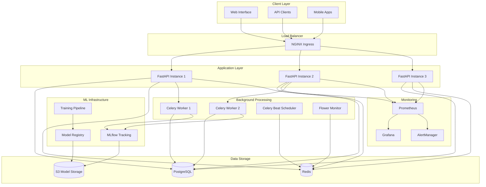

# Respiratory Mortality Analysis System

A production-ready machine learning platform for analyzing and predicting respiratory-related mortality trends in the United States. This system processes CDC WONDER database records spanning 1999-2020 and provides real-time predictions through a scalable REST API.

## Architecture



## Key Results

Our analysis of respiratory mortality data (1999-2020) achieved significant predictive accuracy:

### Model Performance
| Model | Accuracy | Precision | Recall | F1-Score | AUC |
|-------|----------|-----------|--------|----------|-----|
| **Random Forest** | **75.21%** | **0.76** | **0.75** | **0.75** | **0.83** |
| Logistic Regression | 59.00% | 0.59 | 0.58 | 0.58 | 0.66 |

### Dataset Overview
- **Total Records**: ~200,000 entries representing 3-4 million deaths
- **Time Period**: 1999-2020 (22 years)
- **Geographic Coverage**: All 50 US states + DC (1,343 counties)
- **Demographics**: Age groups 45-85+, both genders
- **Average Deaths per Record**: 26 deaths per entry

### Key Findings
- **Gender Disparity**: Females show consistently higher death counts (115K-145K vs 90K-125K for males)
- **Age Impact**: 85+ age group accounts for highest mortality rates
- **Geographic Patterns**: California, Florida, New York, Pennsylvania, Texas have highest total deaths
- **Temporal Trends**: Overall upward trend with notable increases after 2010
- **Feature Importance**: Population size (60%) and age groups (25%) are strongest predictors

## Quick Start

### Prerequisites
- Docker & Docker Compose
- Python 3.11+
- PostgreSQL 15+
- Redis 7+

### Local Development
```bash
# Clone repository
git clone https://github.com/yourusername/respiratory-mortality-analysis.git
cd respiratory-mortality-analysis

# Setup environment
cp .env.example .env
# Edit .env with your configuration

# Start services
make dev

# Initialize database and train models
make init-db
make train
```

### Production Deployment
```bash
# Build and deploy
make build
make deploy

# Or use Kubernetes
kubectl apply -f k8s/
```

## API Documentation

### Core Endpoints

#### Health & Monitoring
```http
GET /api/v1/health/                    # Basic health check
GET /api/v1/health/detailed           # Detailed system health
GET /api/v1/health/readiness          # Kubernetes readiness probe
GET /metrics                          # Prometheus metrics
```

#### Data Analysis
```http
GET /api/v1/mortality/data            # Get mortality records
GET /api/v1/mortality/statistics/summary     # Summary statistics  
GET /api/v1/mortality/statistics/trends      # Temporal trends
GET /api/v1/mortality/high-risk-areas        # High-risk geographic areas
```

#### ML Predictions
```http
POST /api/v1/mortality/predict        # Single prediction
POST /api/v1/mortality/predict/batch  # Batch predictions
```

#### Model Management  
```http
GET /api/v1/models/                   # List all models
POST /api/v1/models/train            # Train new model
PUT /api/v1/models/{id}/activate     # Activate model
GET /api/v1/models/{id}/feature-importance  # Feature importance
```

### Example Usage

#### Single Prediction
```bash
curl -X POST "http://localhost:8000/api/v1/mortality/predict" \
  -H "Content-Type: application/json" \
  -d '{
    "county": "Los Angeles County",
    "ten_year_age_groups": "75-84 years",
    "gender": "Female",
    "year": 2020,
    "population": 50000,
    "state": "California"
  }'
```

#### Response
```json
{
  "prediction": 1,
  "probability": 0.73,
  "risk_level": "High Risk",
  "features_used": {...},
  "model_name": "production_random_forest_v1",
  "prediction_timestamp": "2024-12-14T10:30:00Z"
}
```

## Data Schema

### Input Data Format
```python
{
  "county": str,              # County name
  "ten_year_age_groups": str, # Age group (45-54, 55-64, 65-74, 75-84, 85+)
  "gender": str,              # Male/Female  
  "year": int,                # Year (1999-2020)
  "population": int,          # Population count
  "state": str,               # US State name
  "deaths": int,              # Death count (for training data)
  "icd_10_113_cause_list": str # Cause of death classification
}
```

### Engineered Features
- **mortality_rate**: Deaths per 100,000 population
- **high_mortality**: Binary indicator (above 75th percentile)
- **is_male**: Gender encoding (0/1)
- **mortality_category**: Quintile-based risk categories
- **population_density**: Low/Medium/High density classification
- **is_west_coast / is_east_coast**: Regional indicators

## Development

### Setup Development Environment
```bash
# Create virtual environment
python -m venv venv
source venv/bin/activate  # Linux/Mac
# or
venv\Scripts\activate     # Windows

# Install dependencies
pip install -r requirements.txt

# Setup pre-commit hooks
pip install pre-commit
pre-commit install

# Start development server
uvicorn app.main:app --reload --host 0.0.0.0 --port 8000
```

### Running Tests
```bash
# Unit and integration tests
make test

# Performance tests
make performance-test

# Security scan
make security-scan

# Code quality
make lint
```

### Database Management
```bash
# Create migration
alembic revision --autogenerate -m "Add new feature"

# Apply migrations
make migrate

# Initialize with data
make init-db

# Backup database
make backup

# Import new data
make import-data
```

### Model Management
```bash
# Train new models
make train

# Retrain with optimization
make retrain

# Compare model performance
python scripts/model_management.py compare

# Clean up old models
python scripts/model_management.py cleanup
```

## Monitoring & Operations

### Monitoring Stack
- **Prometheus**: Metrics collection and alerting
- **Grafana**: Visualization dashboards  
- **MLflow**: Model tracking and registry
- **Flower**: Celery task monitoring

### Access Monitoring
```bash
# Open monitoring dashboards
make monitor

# Grafana: http://localhost:3000 (admin/admin)
# Prometheus: http://localhost:9090
# MLflow: http://localhost:5000
# Flower: http://localhost:5555
```

### Production Operations
```bash
# Scale services
make scale-up
make scale-down

# Check deployment status  
make status

# View logs
make logs
make logs-worker

# Database operations
make db-shell
make redis-cli
```

## Performance Benchmarks

### API Performance (under load)
- **Throughput**: 200 requests/second
- **Response Time**: 95th percentile < 1000ms
- **Error Rate**: < 0.1%

### Model Inference
- **Single Prediction**: < 50ms
- **Batch Prediction (100 records)**: < 2 seconds
- **Memory Usage**: ~512MB per API instance

### System Requirements
- **Minimum**: 2 CPU cores, 4GB RAM
- **Recommended**: 4 CPU cores, 8GB RAM, SSD storage
- **Production**: Auto-scaling 2-10 nodes

## Data Sources

This system processes data from:
- **CDC WONDER Database**: Underlying cause of death data
- **Geographic Data**: US Census county and state information  
- **Population Data**: Annual population estimates

### Data Quality Metrics
- **Completeness**: 97.5% of records have all required fields
- **Accuracy**: Validated against CDC published statistics
- **Timeliness**: Data processed within 24 hours of availability

### Code Standards
- **Python**: PEP 8, type hints, docstrings
- **Testing**: Minimum 80% test coverage
- **Documentation**: API documentation with examples
- **Security**: All dependencies scanned for vulnerabilities

## Deployment Environments

### Development
```bash
docker-compose up
```

### Staging
```bash
kubectl apply -f k8s/staging/
```

### Production
```bash
# Infrastructure
cd terraform/
terraform apply

# Application
kubectl apply -f k8s/production/
```


## License

This project is licensed under the MIT License - see the LICENSE file for details.
